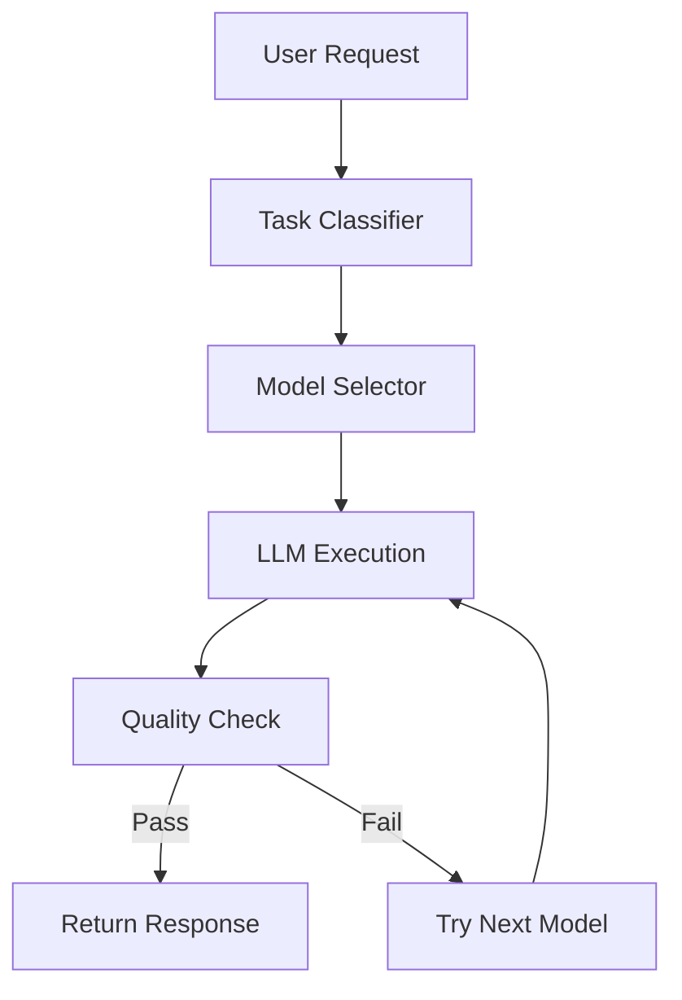

# Dynamic Model Routing Architecture

## Overview
This document describes the architecture for dynamic model routing in the chatbot system, which optimizes cost and performance by intelligently selecting the most appropriate LLM based on task complexity and budget constraints.

## Core Components

### 1. Model Selector Service
```python
class ModelSelector:
    # Model pricing (per 1K tokens)
    PRICING = {
        "phi-3.5-mini": 0.0001,      # Cheap, fast, good for simple tasks
        "mistral-7b": 0.0002,        # Mid-tier, balanced
        "llama-3.1-70b": 0.0008      # Expensive, best quality
    }
    
    async def select_model(self, task: str, budget: float) -> str:
        """Selects the most cost-effective model for the given task and budget."""
        # Implementation...
```

### 2. Model Registry
- **Purpose**: Manages available models and their metadata
- **Key Features**:
  - Model versioning
  - Health checks
  - Performance metrics
  - Cost tracking

### 3. Quality Validator
- Validates model outputs against quality thresholds
- Implements fallback logic when quality is insufficient
- Tracks model performance metrics

## Architecture Diagram



## Implementation Details

### Model Selection Logic
1. **Task Classification**:
   - Simple tasks → Phi-3.5
   - Medium complexity → Mistral-7B
   - Complex tasks → Llama-3.1-70B

2. **Budget Awareness**:
   - Tracks token usage and costs
   - Enforces budget constraints
   - Provides cost estimates before execution

3. **Fallback Mechanism**:
   - Automatic retry with more capable models
   - Graceful degradation under load
   - Circuit breakers to prevent cascading failures

## Integration Points

### With Existing Services
1. **Chatbot Service**:
   ```python
   async def handle_message(message: str):
       task = await classify_task(message)
       model = await model_selector.select_model(task, user_budget)
       response = await execute_model(model, message)
       return response
   ```

2. **Monitoring Service**:
   - Tracks model performance
   - Alerts on quality degradation
   - Provides cost analytics

## Configuration

### Environment Variables
```env
# Model Configuration
MODEL_REGISTRY_URL=http://model-registry:8000
DEFAULT_MODEL=phi-3.5-mini
MAX_FALLBACK_ATTEMPTS=2

# Budget Settings
DEFAULT_BUDGET=0.01  # $0.01 per request
COST_ALERT_THRESHOLD=0.8  # 80% of budget
```

## Performance Considerations

### Latency
- Model warm-up times
- Network overhead for distributed models
- Caching strategies

### Throughput
- Request batching
- Connection pooling
- Load balancing

## Security

### Authentication
- API key validation
- Rate limiting
- Request signing

### Data Privacy
- Input/output sanitization
- Model output validation
- Audit logging

## Monitoring and Alerting

### Key Metrics
- Request latency
- Error rates
- Cost per request
- Model performance

### Alerting Rules
- Budget thresholds
- Error rate spikes
- Latency degradation

## Example Usage

```python
# Initialize the model selector
selector = ModelSelector()

# Process a user request
async def process_request(user_input: str, user_budget: float):
    # Classify the task
    task = await classify_task(user_input)
    
    # Select appropriate model
    model = await selector.select_model(task, user_budget)
    
    # Execute with fallback
    response = await selector.execute_with_fallback(
        prompt=user_input,
        task=task
    )
    
    return response
```

## Zendesk Analytics Integration

### Shared Infrastructure
```
┌──────────────────────────────────────────────────────┐
│  SHARED FOUNDATION                                   │
├──────────────────────────────────────────────────────┤
│  • Kubernetes (EKS) - Analytics node pool           │
│  • Postgres (RDS) - Zendesk schemas                 │
│  • Redis (ElastiCache) - Query cache keyspace       │
│  • Kafka - Analytics topics                         │
│  • Milvus - Zendesk embeddings collection           │
│  • Neo4j - Ticket relationship graphs               │
│  • LLM Management API (Flask) - Reused as-is        │
└──────────────────────────────────────────────────────┘
```

### Data Flow Architecture
```
Zendesk API → Connector Service → Kafka (zendesk.tickets.raw)
                                      ↓
                      ┌───────────────┴───────────────┐
                      ↓                               ↓
              Postgres (structured)          Embedding Service
                      ↓                               ↓
           Query Execution Engine              Milvus (vectors)
                      ↓                               ↓
                   Redis Cache                 Semantic Search
                      ↓                               ↓
              ┌───────┴────────────────────────────────┘
              ↓
      LLM Model Router (Flask API) → [Phi-3.5 | Mistral | Llama]
              ↓
      Response Formatter → User
```

### Multi-Tier Cost Model
| Query Type          | Execution Path               | Avg Cost  | Target % |
|---------------------|-----------------------------|-----------|----------|
| Cache Hit           | Redis lookup                | $0.0001   | 60%      |
| Simple SQL          | Postgres + Phi-3.5           | $0.001    | 25%      |
| Semantic Search     | Milvus + Mistral             | $0.01     | 10%      |
| Complex Analysis    | Full pipeline + Llama         | $0.25     | 5%       |

**Expected Blended Cost**: ~$0.015/query (vs $0.25 if always using Llama 70B)

### Implementation Phases
1. **Infrastructure (Week 1-2)**
   ```bash
   terraform apply -target=module.analytics_platform
   ```
   - Creates: Analytics API, Zendesk connector, UI pods
   - Reuses: EKS, RDS, Redis, Kafka, Milvus, Neo4j

2. **Data Migration (Week 3-4)**
   - Initial Zendesk sync (1M tickets in ~8 hours)
   - Generate embeddings (10M comments in ~12 hours)
   - Build Neo4j relationship graph (~4 hours)

3. **Service Deployment (Week 5-6)**
   ```bash
   helm upgrade --install analytics-api ./helm/analytics-api
   helm upgrade --install zendesk-connector ./helm/zendesk-connector
   helm upgrade --install analytics-ui ./helm/analytics-ui
   ```

4. **Validation (Week 7-8)**
   - Integration testing
   - Performance benchmarking
   - Security audit
   - Gradual rollout

## Technical Decisions

### Why Reuse Voice AI Infrastructure?
- **80% faster**: Avoid 3-4 months of setup
- **60% cheaper**: Shared resources
- **Proven reliability**: Battle-tested stack
- **Unified operations**: Single platform to maintain

### Multi-Model Strategy
- **Phi-3.5 (70% of queries)**: Intent classification, simple SQL
- **Mistral-7B (20% of queries)**: Medium complexity analysis
- **Llama 70B (10% of queries)**: Root cause analysis

**Result**: 85% cost savings vs always using Llama 70B

## Monitoring & Observability

### Shared Dashboards (Grafana)
1. **Query Performance**
   - Latency by intent type (p50, p95, p99)
   - Cache hit rate (target: >60%)
   - Model selection distribution
   - Cost per query (target: <$0.02)

2. **Pipeline Health**
   - Zendesk sync lag (target: <5 minutes)
   - Embedding generation rate (target: 10K/min)
   - Milvus index size
   - Postgres connection pool utilization

### Alerting Rules (Prometheus)
```yaml
- alert: AnalyticsHighLatency
  expr: histogram_quantile(0.95, analytics_query_duration_seconds) > 3
  for: 5m
  annotations:
    summary: "95th percentile query latency >3s"

- alert: AnalyticsCacheHitRateLow
  expr: rate(analytics_cache_hits_total[5m]) / rate(analytics_queries_total[5m]) < 0.5
  for: 15m
  annotations:
    summary: "Cache hit rate below 50% for 15 minutes"
```

## Future Enhancements

1. **Dynamic Model Loading**
   - On-demand model loading/unloading
   - Model version A/B testing

2. **Adaptive Routing**
   - Real-time performance monitoring
   - Automatic model switching based on load

3. **Multi-cloud Support**
   - Cloud provider-agnostic deployment
   - Cost optimization across providers
