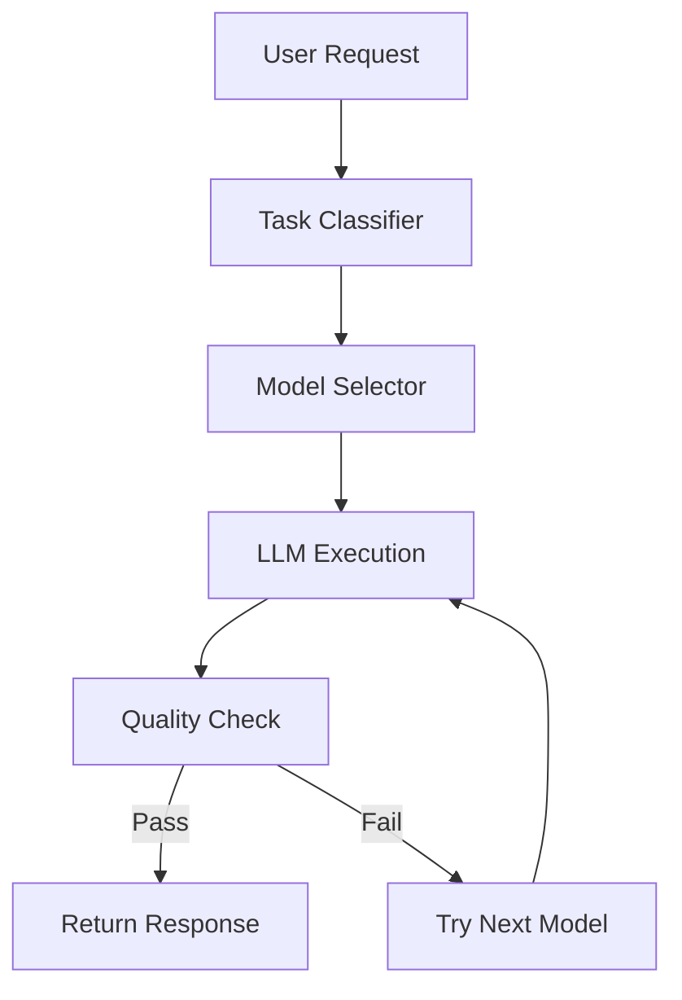

# Dynamic Model Routing Architecture

## Overview
This document describes the architecture for dynamic model routing in the chatbot system, which optimizes cost and performance by intelligently selecting the most appropriate LLM based on task complexity and budget constraints.

## Core Components

### 1. Model Selector Service
```python
class ModelSelector:
    # Model pricing (per 1K tokens)
    PRICING = {
        "phi-3.5-mini": 0.0001,      # Cheap, fast, good for simple tasks
        "mistral-7b": 0.0002,        # Mid-tier, balanced
        "llama-3.1-70b": 0.0008      # Expensive, best quality
    }
    
    async def select_model(self, task: str, budget: float) -> str:
        """Selects the most cost-effective model for the given task and budget."""
        # Implementation...
```

### 2. Model Registry
- **Purpose**: Manages available models and their metadata
- **Key Features**:
  - Model versioning
  - Health checks
  - Performance metrics
  - Cost tracking

### 3. Quality Validator
- Validates model outputs against quality thresholds
- Implements fallback logic when quality is insufficient
- Tracks model performance metrics

## Architecture Diagram



## Implementation Details

### Model Selection Logic
1. **Task Classification**:
   - Simple tasks → Phi-3.5
   - Medium complexity → Mistral-7B
   - Complex tasks → Llama-3.1-70B

2. **Budget Awareness**:
   - Tracks token usage and costs
   - Enforces budget constraints
   - Provides cost estimates before execution

3. **Fallback Mechanism**:
   - Automatic retry with more capable models
   - Graceful degradation under load
   - Circuit breakers to prevent cascading failures

## Integration Points

### With Existing Services
1. **Chatbot Service**:
   ```python
   async def handle_message(message: str):
       task = await classify_task(message)
       model = await model_selector.select_model(task, user_budget)
       response = await execute_model(model, message)
       return response
   ```

2. **Monitoring Service**:
   - Tracks model performance
   - Alerts on quality degradation
   - Provides cost analytics

## Configuration

### Environment Variables
```env
# Model Configuration
MODEL_REGISTRY_URL=http://model-registry:8000
DEFAULT_MODEL=phi-3.5-mini
MAX_FALLBACK_ATTEMPTS=2

# Budget Settings
DEFAULT_BUDGET=0.01  # $0.01 per request
COST_ALERT_THRESHOLD=0.8  # 80% of budget
```

## Performance Considerations

### Latency
- Model warm-up times
- Network overhead for distributed models
- Caching strategies

### Throughput
- Request batching
- Connection pooling
- Load balancing

## Security

### Authentication
- API key validation
- Rate limiting
- Request signing

### Data Privacy
- Input/output sanitization
- Model output validation
- Audit logging

## Monitoring and Alerting

### Key Metrics
- Request latency
- Error rates
- Cost per request
- Model performance

### Alerting Rules
- Budget thresholds
- Error rate spikes
- Latency degradation

## Example Usage

```python
# Initialize the model selector
selector = ModelSelector()

# Process a user request
async def process_request(user_input: str, user_budget: float):
    # Classify the task
    task = await classify_task(user_input)
    
    # Select appropriate model
    model = await selector.select_model(task, user_budget)
    
    # Execute with fallback
    response = await selector.execute_with_fallback(
        prompt=user_input,
        task=task
    )
    
    return response
```

## Future Enhancements

1. **Dynamic Model Loading**:
   - On-demand model loading/unloading
   - Model version A/B testing

2. **Adaptive Routing**:
   - Real-time performance monitoring
   - Automatic model switching based on load

3. **Multi-cloud Support**:
   - Cloud provider-agnostic deployment
   - Cost optimization across providers
