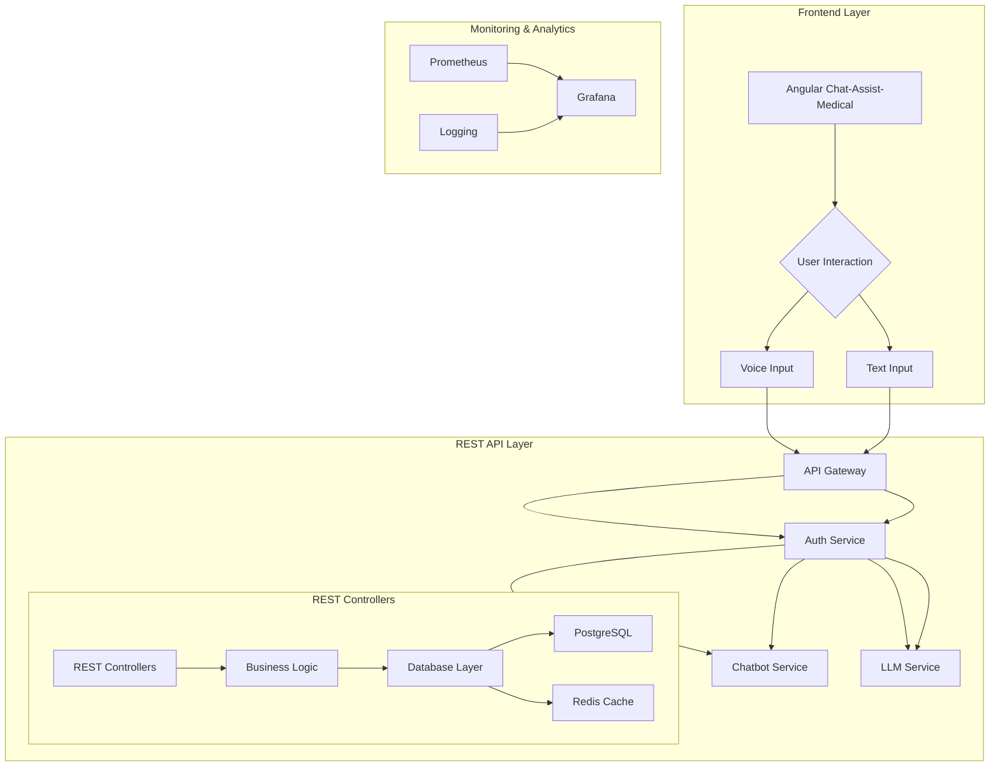

# Chatbot Platform Architecture

[Back to Main Architecture](../README.md)

## Architecture Variants

1. [REST Architecture](#rest-architecture-for-chatbot-platform) - Standard REST-based implementation
2. [Dynamic Model Routing](./DYNAMIC_MODEL_ROUTING.md) - Advanced model selection with cost optimization

## REST Architecture for Chatbot Platform

## Author
Aldo Grandoni

## Overview
This directory contains the detailed REST-based architecture for the Chatbot platform, focusing on the integration between the Spring Boot backend and the Angular chat-assist-medical frontend.

### Frontend Integration
The frontend is built using Angular and provides a medical-focused chat interface called chat-assist-medical. Key features include:

- Modern, responsive UI design optimized for medical professionals
- Real-time chat functionality with both text and voice input
- Integration with medical terminology and specialized chat features
- Secure authentication and user management
- Responsive design for both desktop and mobile devices

The frontend communicates with the backend through RESTful APIs, following a clean separation of concerns between presentation and business logic.

## System Architecture



## Directory Structure

```
architecture_chatbot/
├── charts/
│   └── spring-client/
│       ├── Chart.yaml
│       └── templates/
├── docs/
│   ├── ARCHITECTURE.md
│   └── DEPLOYMENT.md
└── secrets/
    └── spring-client-secrets.yaml
```

## Documentation

For detailed architecture documentation, see:
- [Architecture Overview](docs/ARCHITECTURE.md)
- [Deployment Guide](docs/DEPLOYMENT.md)

## Related Repositories

This project is part of the larger medical chatbot platform ecosystem. Key related repositories include:

- [chat-assist-medical](https://github.com/cloud-fullstack/chat-assist-medical): Angular medical chat interface mockup
- [infrastructure](https://github.com/cloud-fullstack/infra/): Infrastructure as Code (Terraform) for VPS setup and K3s cluster
- [k3s](https://github.com/cloud-fullstack/k3s/): Kubernetes cluster configuration and Helm charts
- [chatbot-backend](https://github.com/cloud-fullstack/backend_spring_chatbot/): Spring Boot backend services
- [chatbot-docker](https://github.com/cloud-fullstack/chatbot-docker/): Docker configurations and deployment scripts
- [spring-client-chatbot](https://github.com/cloud-fullstack/spring-client-chatbot/): Spring Boot client application

## Frontend Integration

The chat-assist-medical frontend is an Angular-based medical chat interface that provides:

### Key Features
- Medical-focused chat interface with specialized terminology
- Real-time text and voice communication
- Secure authentication and authorization
- Responsive design for desktop and mobile
- Integration with medical knowledge base

### Technical Details
- Built with Angular 18.x
- Uses Angular Material for UI components
- Implements NgRx for state management
- Uses RxJS for reactive programming
- Supports internationalization (i18n)

### Integration Points
The frontend communicates with the backend through REST endpoints:
- Authentication: `/api/auth/*`
- Chat: `/api/chat/*`
- User Management: `/api/users/*`
- Voice Processing: `/api/voice/*`

Each repository contains its own detailed documentation and setup instructions.

## Security Architecture

### API Security
- JWT-based authentication
- Role-based access control
- Request validation
- Rate limiting
- Secure credential management

### Database Security
- PostgreSQL with optimized settings
- Redis for caching
- Separate storage for each service
- Backup configurations
- Data encryption

## Monitoring Architecture

### API Monitoring
- Prometheus metrics collection
- Grafana dashboards
- Alertmanager notifications
- API-specific metrics
- Performance monitoring

### System Monitoring
- Node Exporter for node metrics
- Regular health checks
- Performance monitoring
- Disk usage monitoring
- Resource optimization

## Documentation

### rest_architecture.md
- REST infrastructure details
- API endpoint organization
- Error handling strategy
- Performance considerations

### api_design.md
- API specifications
- Request/response formats
- Versioning strategy
- Rate limiting configuration

### security.md
- Security configurations
- Authentication
- Authorization
- Encryption
- Monitoring

### monitoring.md
- Monitoring configurations
- Alert thresholds
- Dashboard setup
- Log aggregation
- Performance metrics

[Back to Main Architecture](../README.md)
